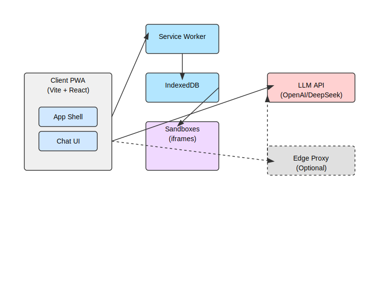

# BigBox - AI Generated Micro-Apps Platform

<div align="center">
  
  <h3>Create, Manage and Run Self-Contained Web Apps</h3>
</div>

## 📱 Overview

**BigBox** is a mobile-first Progressive Web App (PWA) that enables users to generate and run HTML micro-apps through an AI chat interface. Apps are executed in secure sandboxed iframes and stored locally using IndexedDB. The platform features an Android-style home screen interface optimized for mobile devices with full offline capabilities.

<div align="center">
  
</div>

## ✨ Key Features

- **AI-Generated Apps**: Chat interface to create fully functional web apps
- **Android-Style Interface**: Mobile-optimized home screen with app grid
- **Secure Sandbox Environment**: Apps run in isolated iframes
- **Offline-First**: Full functionality without internet connection
- **Progressive Web App**: Installable on any device with modern browsers
- **Local Storage**: All data remains on device using IndexedDB

## 🏗️ Architecture

The project is organized as a monorepo with the following structure:

```
BigBox/
├── packages/
│   ├── bigbox-pwa/           # Main PWA Application
│   └── sandbox-manager/      # Core SDK for sandbox management
└── docs/                     # Documentation
```

### Core Components

1. **HomeShell UI**: Android-style interface with wallpapers, app grid, and dock
2. **SandboxManager SDK**: Core library for managing and running sandboxed applications
3. **Service Worker**: PWA capabilities and offline caching
4. **IndexedDB**: Local storage for app data and generated content

## 🛠️ Tech Stack

- **Frontend**: React 18 + TypeScript + Vite
- **Styling**: Custom CSS with Android-inspired design
- **PWA**: Workbox Service Worker + Web Manifest
- **Storage**: IndexedDB with `idb` library
- **Package Manager**: pnpm workspace
- **Build Tools**: Vite with PWA plugin

## 🔄 PWA Features

- **Installable**: Add to home screen on any device
- **Offline Support**: Works without internet connection
- **App-Like Experience**: Fullscreen mode, no browser chrome
- **Fast Loading**: Service worker caching for assets
- **Background Sync**: Ready for future API integration

## 🚀 Getting Started

### Prerequisites

- Node.js 18+ 
- pnpm (recommended) or npm

### Installation

```bash
# Clone the repository
git clone https://github.com/yourusername/BigBox.git
cd BigBox

# Install dependencies
pnpm install

# Start development server
pnpm --filter bigbox-pwa dev

# Access the app at http://localhost:5174/
```

### Build and Preview

```bash
# Build for production
pnpm --filter bigbox-pwa build

# Preview production build
pnpm --filter bigbox-pwa preview
```

## 🔍 AI App Generation

BigBox comes with two modes for generating apps:

1. **Demo Mode**: Works without API keys and provides basic app templates
   - Calculator
   - Todo List
   - Timer

2. **Full AI Mode**: Requires OpenAI API key
   - Generates custom apps based on user prompts
   - Full HTML/CSS/JavaScript capabilities
   - Supports complex interactions and functionality

## 🧩 SandboxManager SDK

The core SDK (`@bigbox/sandbox-manager`) provides functionality for:

- Creating and storing sandboxes
- Running apps in secure iframes
- Managing lifecycle (start, pause, resume, stop)
- Content hashing for deduplication
- Event system for real-time updates

## 📱 Mobile Experience

BigBox is designed mobile-first with:

- Responsive design with mobile breakpoints
- Touch-optimized interactions
- Android-style navigation and UI elements
- Fullscreen mode for app-like experience
- Install prompt for adding to home screen

## 🔒 Security Model

- **Sandbox Isolation**: Apps run in iframes with restricted permissions
- **Content Security**: No external resource access by default
- **Local Storage**: All data stays on device
- **Content Hashing**: Integrity verification for generated apps

## 🤝 Contributing

Contributions are welcome! Please feel free to submit a Pull Request.

1. Fork the repository
2. Create your feature branch (`git checkout -b feature/amazing-feature`)
3. Commit your changes (`git commit -m 'Add some amazing feature'`)
4. Push to the branch (`git push origin feature/amazing-feature`)
5. Open a Pull Request

## 📝 License

This project is licensed under the MIT License - see the LICENSE file for details. 